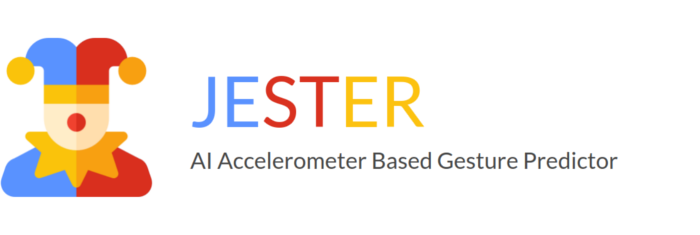
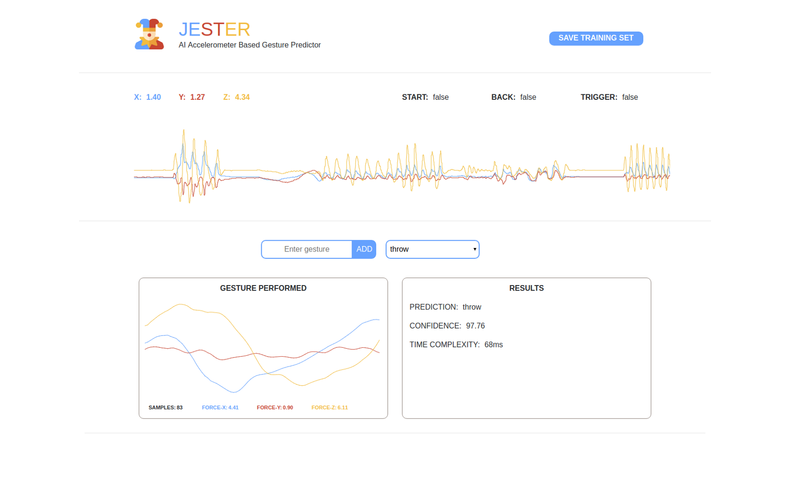

# ABOUT

I am [Christopher Dedominici](https://www.linkedin.com/in/christopher-dedominici/) and with my friend and colleague [Matteo Pisani](https://www.linkedin.com/in/matteopisani) I developed JESTER, a machine learning tool.

 

# FOREWORD

Today machine learning and artificial intelligence are a predominant topic: they can be used to add many functionalities and improve user experience.

We decided to implement these technologies to create a software tool that can be used to train and recognize gestures of different controllers and sensor-tags.

Hence we are happy to introduce you to JESTER.

 

# WHAT IS JESTER?

Clustering the incoming raw data from VR controllers or sensor-tags Jester is able to train and recognize accelerometer based gestures.
 It was developed to run on both desktop and mobile, handling Bluetooth LE pairings and data exchange. 
 With Jester is possible to set up custom interaction layers that can be used in different fields, for example as input system for gaming, sport industry, automotive and many others.

But what does it mean exactly?

Essentially we want the algorithm to learn by itself when a specific movement is made and then trigger a specific instruction.

>  *User scenario: Imagine you are playing a VR game in the role of a wizard: if you move the controller and draw a circle in the air, you will perform a specific X spell while if you draw a triangle you will perform a different spell Y.*
> *Although, how does the system understand that you are performing different movements (circle, triangle, etc.)?*

 

# ALGORITHM

The main algorithm behind Jester is a DTW. 

#### PREFACE

To make everything possible the device has to send packets which contain at least acceleration data. In this demo we are using the Ximmerse Flip controller.

#### TRAINING

This step does not imply any complex calculation: the tool stores all the gestures performed by the user allowing him to label them before creating the training set.

# RECOGNITION

Each gesture is stored into an array that is compared to all the others in the training set. 
By using the DTW algorithm introduced above, we calculated the distance between the input array and the current one in the iteration: this allowed us to assign a weight to their difference. 
Plus, we customized the distance function to get higher confidence and applied several optimizations to get faster predictions. 

 

# HOW THE TOOL WORKS

The screen is divided into two horizontal sections. 
On the top section there is a chart, which is constantly updated and it shows the device accelerations on the 3 axis. 
On the bottom section there is a discrete chart, where the user can observe the last performed gesture.

#### CREATE A TRAINING SET

The user has to enter the label he wants to assign to the specific gesture and then he can perform it. 
To store the gesture the user needs to press the controller button A, perform the gesture and then release the button when the gesture is done. 
The bottom chart will show the pattern of the gesture just performed and it will be stored in memory.

#### TEST THE TRAINING SET

After a gesture has been recognized, a pop-up will appear showing the following information: the prediction duration in milliseconds, the predicted direction and its accuracy in percentage.

 

# VIDEO EXAMPLE

Have a look at the video below to better understand how it works:

[Jester Video](https://www.youtube.com/watch?v=5oQdl7yf5OE) 
 
  
  
  
# WHAT IS NEXT

Actually we are improving the prediction layer to make it faster and more precise. 
We are developing a new tool that can facilitate and better analyse gestures patterns in order to choose the best algorithm to compute the prediction accordingly to the needs of the end user.
